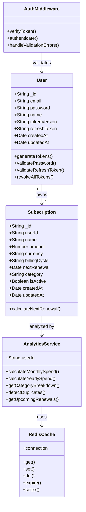

# SubTrak - Subscription Intelligence App

SubTrak is a real-time subscription intelligence app that helps users detect and manage recurring payments. Built with MERN and Redis, it delivers instant renewal alerts, duplicate detection, and cost analytics enabling proactive cancellations and smarter financial control.

## Features

### Core Features 
- **User Authentication** - JWT-based secure authentication with refresh tokens
- **Subscription Management** - Add, edit, delete, and view subscriptions
- **Renewal Tracking** - Monitor upcoming subscription renewals
- **Cost Analytics** - Monthly and yearly spending breakdown
- **Duplicate Detection** - Identify potential duplicate subscriptions
- **Category Organization** - Group subscriptions by type (Entertainment, Software, etc.)
- **Dashboard Overview** - Quick stats and upcoming renewals at a glance

## System Architecture - Backend


## API Endpoints

All endpoints except `/auth/register` and `/auth/login` require JWT authentication via Bearer token in Authorization header.

### Authentication Endpoints
```
POST   /api/auth/register          - Register new user
POST   /api/auth/login             - Login user
POST   /api/auth/refresh           - Refresh JWT token
POST   /api/auth/logout            - Logout current session (Protected)
POST   /api/auth/logout-all        - Logout all devices (Protected)
POST   /api/auth/change-password   - Change password (Protected)
GET    /api/auth/profile           - Get user profile (Protected)
PUT    /api/auth/profile           - Update user profile (Protected)
```

### Subscription Endpoints
```
GET    /api/subscriptions          - Get all user subscriptions (Protected)
POST   /api/subscriptions          - Create new subscription (Protected)
GET    /api/subscriptions/:id      - Get single subscription (Protected)
PUT    /api/subscriptions/:id      - Update subscription (Protected)
DELETE /api/subscriptions/:id      - Delete subscription (Protected)
```

### Analytics Endpoints
```
GET    /api/analytics/summary      - Get spending summary (Protected)
GET    /api/analytics/categories   - Get category breakdown (Protected)
GET    /api/analytics/duplicates   - Check for duplicate subscriptions (Protected)
GET    /api/analytics/upcoming     - Get upcoming renewals (Protected)
```

## Tech Stack

### Backend
- **Node.js** - Runtime environment
- **Express.js** - Web framework
- **MongoDB** - Primary database
- **Redis** - Caching and session management
- **JWT** - Authentication tokens
- **Bcrypt** - Password hashing
- **Mongoose** - MongoDB ODM

### Frontend
- **React.js** - UI framework
- **React Router** - Navigation
- **Axios** - HTTP client
- **Context API** - State management
- **Chart.js** - Analytics visualization

### Development Tools
- **Nodemon** - Development server
- **dotenv** - Environment variables
- **cors** - Cross-origin resource sharing
- **express-validator** - Input validation

## Environment Variables
```env
NODE_ENV=development
PORT=5000
MONGODB_URI=mongodb://localhost:27017/subtrak
REDIS_URL=redis://localhost:6379
JWT_SECRET=your_jwt_secret_key_here
JWT_EXPIRE=1h
```

## Installation and Setup
```bash
# Clone the repository
git clone https://github.com/yourusername/subtrak.git

# Install backend dependencies
cd subtrak/backend
npm install

# Install frontend dependencies
cd ../client
npm install

# Setup environment variables
cp .env.example .env

# Start Redis server
redis-server

# Start MongoDB
mongod

# Run backend server
npm run dev

# Run frontend (in another terminal)
cd client
npm start
```

## Quick Start Guide

1. Register a new account via `/api/auth/register`
2. Login to receive JWT token
3. Add subscriptions with renewal dates
4. View dashboard for spending analytics
5. Monitor upcoming renewals
6. Detect and manage duplicate subscriptions
